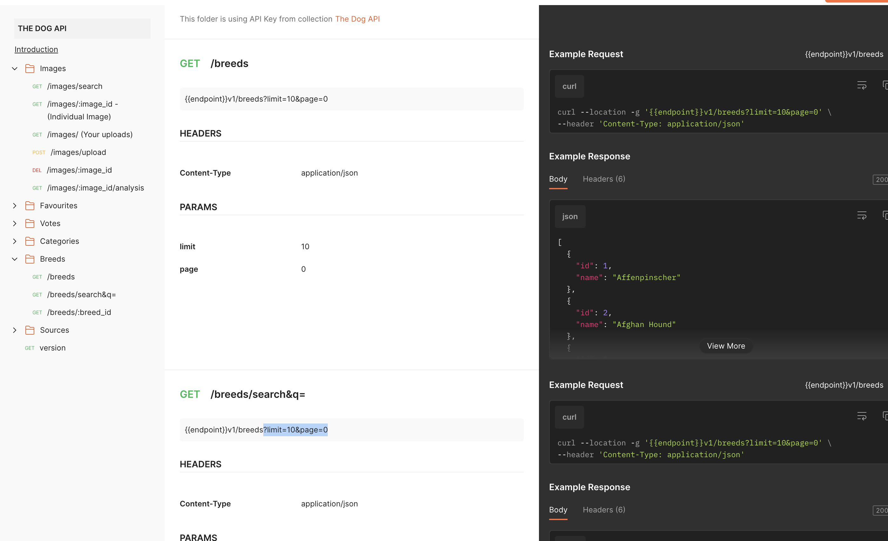

# Dog breed search (Coding Assignment)

This project was created with vite + typescript. Using axios to fetch http request.

## Project structure overview

```sh
public
src
├── api
│   └── dog.ts
├── assets
├── commponents
│   └── Image.tsx
├── pages
│   ├── index.tsx
│   └── Search.tsx
├── test
│   └── setup.ts
├── utils
│   ├── api.tsx
│   └── querystring.tsx
└── main.tsx
```

Folder util is quite handful. As I progress on my career in web development, common issue such as request timeout not working properly and querystring that returns empty string (e.g. query=''). These bad practices had to be resolve in custom made util.

## Entrypoint

Moving on to `main.tsx` is where we prepopulate the routes. The implementation is inspired by NextJS projects to showcase how similar implementation can be done. Although not perfect yet for nested directory.

## References

List of references I used while creating this project

- [vite-official](https://vitejs.dev/)
- [vite-route-blog](https://dev.to/franciscomendes10866/file-based-routing-using-vite-and-react-router-3fdo)
- [how-to-route](https://github.com/FranciscoMendes10866/react-vite-file-based-routing/blob/main/src/App.tsx)
- [how-to-lazy](https://medium.com/swlh/dog-app-using-javascript-with-an-api-72d944af6773)

## Issues

Per Wed 28 June 2023, There seems to be endpoint descrepancies that requires an updateon the docs.

- GET `/breeds` uses `{{endpoint}}v1/breeds?limit=10&page=0`
- GET `/breeds/search&q=` uses `{{endpoint}}v1/breeds?limit=10&page=0`

One more to add is **limit** and **page** parameters only works on `/breeds`, an example `/breeds/search?limit=10&page=0&q=po` returns 27 results. As best practices I would fix it from endpoint instead of doing a hackish workaround on clientside.

